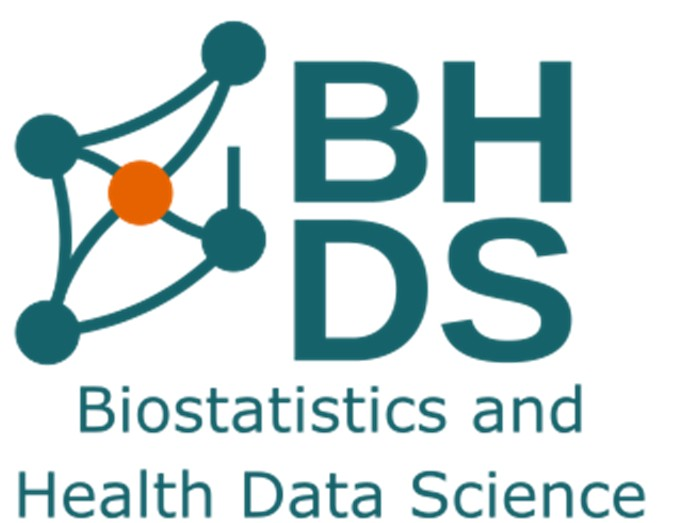

```{r, results='asis', echo=FALSE, out.width='110%', out.height='15%', fig.align='center'}
cat('
<table width="100%">
  <tr>
    <td width="30%">
      
    </td>
    <td width="60%" align="center" style="font-size:32px; font-weight:bold; background-color:white; color:white;">
                                            
    </td>
    <td width="20%">
      
    </td>
  </tr>
</table>
')
```

------------------------------------------------------------------------

```{r setup, include=FALSE}
knitr::opts_chunk$set(echo = TRUE)
packages<- c("rmarkdown","knitr","dplyr","plotly","readxl")
to_install<-packages[!(packages%in%installed.packages()[,"Package"])]
if (length(to_install))install.packages(to_install)
lapply(packages,library,character.only=TRUE)

```

### Data collection, synthesis and Analysis of Gender Inequality in LMICs using DHS and IPUMS-DHS Data

```{r, results='asis', echo=FALSE, out.width='110%', out.height='15%', fig.align='center'}
cat('<hr>
<div style="text-align: left; font-size: 16px; margin-top: 30px;">
  <em>Author: Ijeoma<br>
  Date: 2025-08-26</em>
</div>')
```

-   About BDHS Group

-   About DHS and IPUMS-DHS

### Project Background

The Biostatistics and Health Data Science Group, is a multi-disciplinary academic research and teaching under the IAHS charcteristed by collaborative research, consultancy and training across clinical, biological and global health domains. In the global health domain where I was assigned to, the data used to conduct the research as well as for training purposes are collected from a number of secure sources, including the [The DHS Program](https://dhsprogram.com).

The DHS Program, funded by USAID collects nationally representative global health data and uses it to monitor and evaluate population, health, and nutrition porgrams which is in line with SDG.......

However, the DHS Program has been suspended and currently undergoing review for further funding. During the period of this review, new registerations are not being accepted, hence restricting access to datasets in addition to other far-reaching effect as highlighted by (cite when data goes dark). This professional work-based placement project, with the Biostatistics and Health Data Science group, UoA, aims to gather, synthesize and analyse, datasets from Demographic and Health Surveys(DHS) program that are relevant to global health projects relevant to the team. This is to mitigate the recent suspension of the dhs program, hence limiting access to only existing registered users as new registerations/data requests are not being accepted.

Access was given to me using my supervisor's login to carry out my data acquisition from DHS Program website, however, Exploratory data analysis was done using harmonized datasets from [IPUMS-DHS website](https://www.idhsdata.org/idhs/) as merging of DHS datasets was not feasible due to memory and time constraint. IPUMS-DHS harmonizes data from the Demographic and Health Surveys (DHS) across countries and over time. The integrated microdata extracted from IPUMS-DHS enables cross-country and trend analyses over time. The data is free to use for research and teaching purposes, however, users must register for an account and agree to the terms of use.

To access datasets, new users must [register for an account](https://dhsprogram.com/data/new-user-registration.cfm) on the [The DHS Program](https://dhsprogram.com) website and [apply for datasets](https://www.idhsdata.org/idhs/apply) on the [IPUMS-DHS](https://www.idhsdata.org/idhs/) website.

## Project Aim

This project achieved two aims

1.  Created a global health data repository of DHS Datasets for 38 years (1984-2022)
2.  Pooled Cross country Exploratory Data Analysis of Gender Inequalities in women of child bearing age.

## Methods
The project was carried out in two phases:
Documentation was ensured all through the project wth provides clear instructions and explanation of codes to ensure transparency and reproducibility of the workflow results and analysis results.

### Autodownload_Workflow

A structured workflow which serves as a comprehensive toolkit for accessing, processing, and locally managing DHS downloads was scripted using R Markdown, enabling seamless data retrieval for collaborative research. This repository is designes to support global health studies by providing structured reproducible scripts that ensure secure data access, automate downloads, and systematically oraganize datasets for pooled cross-country analysis.

The workflow includes the following key components:
-   Secure data access: Utilizes DHS login credentials to authenticate and access datasets.
-   Automated downloads: Scripts to automatically download specified datasets based on user-defined parameters (e.g., country, year, survey type).
-   Data organization: Systematically organizes downloaded datasets into a structured directory for easy access and management.
-   


### IPUMS-DHS File Merge Workflow
A structured workflow for merging IPUMS-DHS datasets from multiple countries and years was scripted using R Markdown, enabling seamless integration of harmonized data for comprehensive cross-country analysis. This repository is designed to support global health studies by providing structured reproducible scripts that ensure efficient data merging, variable mapping, and dataset management.

The workflow includes the following key components:
-   Data import: Scripts to import IPUMS-DHS datasets based on user-defined parameters (e.g., country, year).
-   Variable mapping: Aligns variables across different datasets to ensure consistency and comparability.
-   Data merging: Combines datasets from multiple countries and years into a single comprehensive dataset for analysis.
-   Documentation: Provides clear instructions and documentation to facilitate use by other researchers.

### Exploratory Data Analysis of Gender Inequalities using IPUMS-DHS Data

-   Dataset overview
-   IPV
-   FGM
-   AHCDM

------------------------------------------------------------------------

## Outcomes

-   Autodownload scripts for DHS Datasets
-   Variable mappings (DHS and IPUMS-DHS)
-   EDA Rmarkdown scripts
-   SPSS EDA Syntax files
-   SPSS EDA Outputs
-   SPSS Syntax file for pilot file merge (Kenya-Tanzania DHS IR Files 2021)
-   Documentation and reproducible workflows for IPUMS-DHS file merge


## Implications for the Organisation:
-   The Autodownload workflow can be used by the team to access and download datasets from DHS program website for future research projects
-   The IPUMS-DHS file merge workflow can be used by the team to merge IR datasets from IPUMS-DHS website for future research projects.
-   The EDA scripts can be used by the team to carry out exploratory data analysis on IPUMS-DHS datasets for future research projects.
-   The documentation and reproducible workflows can be used by the team to understand the process of accessing, downloading, merging and analysing datasets from DHS program and IPUMS-DHS website for future research projects.
-  The variable mappings can be used by the team to understand the variables in DHS and IPUMS-DHS datasets.
-  The SPSS syntax files can be used by the team to carry out exploratory data analysis on IPUMS-DHS datasets using SPSS as well as verify results without having to perform the analysis from scratch.


Pay attention to the following: Assessment targets Learning Outcomes 4&7 4. Demonstrate evidence of the application of academic and technical skills in the workplace, including collection of relevant data, synthesis, analysis and interpretation;


### Academic skills in the workplace to highlight.
- collection of relevant data: DHS, IPUM-DHS data access and download - synthesis: data wrangling, variable mapping, dataset merging
- analysis and interpretation; EDA, visualisation, reporting
- Reproducibility: Use of Rmarkdown with adequate documentation, version control and renv. setting ensured, SPSS syntax documented for every step of the analysis carried out on spss. -data security and ethical considerations: Data accessed with secure login details, data stored on secure UoA servers, no data shared with third parties.
-data quality checks: Missing data, outliers, duplicates, inconsistencies

7.  Clearly communicate data science outputs to relevant stakeholders.

-   Communication template: Rmarkdown, SPSS syntax, documentation
-   Communication Channel: Email, Power-point Presentation
-   Reporting: Executive report, EDA reports
-   Visualisation: Plotly, ggplot2

## Part A. Main report

Your submission should evidence the application of academic skills in the workplace and the PDF report should include relevant coverage on of the following:

-   background/context of your project,
-   the aim,
-   methods,
-   result(s)/product(s) and
-   the implications of your work for the organisation.

## Part B. Appraisal
*What Has Gone Well*

1. Balance between promoting independent work, collaborative work and the right amount of supervisory support to keep me on track: This enabled me to grow confident in taking initiatives to explore solutions to problems and present them while escalating the challenge and then receiving feedbacks based on how to proceed. This is a more proactive approach to problem solving rather than escallating a problem and waiting for the solution to be handed to me which is more passive.It has also helped me hone in on my critical thinking skills.

The collaborative phase of the project helped me appreciate the gains of working as a team including, knowledge sharing and feedback which reinforces learning, unified objective and checking each other which ensures progress. I also learnt that skills/proficiency within the team might ot be evenly distributed which leads to uneven shared workload which can further lead to very minimal or no contribution to the objectives from team members with less workload.

2. Access to resource materials and bootcamp trainings: The DHS program website is replete with information about the program, datasets, how to use them along with trainings and resources all of which are very useful, yet can be overwhelming initially, however , the bootcamps trainings provided by my host which delved into microdata analysis for topic specific research and how they are used for analysis as well as result interpretations and implications, helped me to translate and connect these informations to applicable outcomes and usage. Hence eliminating the overwhelm and sparking my curiosity to constantly engage with the resources and every new learning was met with an appreciation for the dept of rigour that goes into global health research

3. Regular Review Meetings with my SUpervisors: I had regular review meetings both physcial and  online with my supervisors and peer which provided clarity on my project tasks, tackled challenges and provided feedback on my progress and arears I needed to work on, all of which were pivotal for my growth.The meetings provided a safe space for me to be innovative as well as share my concerns when stuck and receive guidiance.

4. Workplace wellbeing: A comfortable workspace was provided for me with accessibility to my suppervisors which made me feel included with the team. Also, I was invited to team-wide monthly meetings which helped me familiarize with the team and the nature of work that goes on within an academic research and teaching organisation like the BHDS. This gave me a sense of responsibity as part of a wider unit and made me feel welcome while also challenging me to contribute positively to the team. Additionally, the flexible workhour enabled me to manage my personal commitments with work-based placement activities. Hinderances to my productivity in terms of health and other personal conflicting priorities were properly communicated in a professional manner and was met with empathy and support from my suppervisors which contributed positively to my wellbeing.
 
 

*What hasn't gone so well*:
1. Storage challenge due to data volume: A more harmonized IPUMS DHS dataset requiring less computational resource was used, hence optimizing available memory space.
2. Personal device limitation: My personal device was limited in capacity and speed to handle the large data set which lagged it down making me to resort to using the instituion devices. I had to trade off the felxibility of working remotely with the better functionality and efficiency of using the school compuetrs. While this seemed like a constraint, it helped me hone my skills in the use of Github for version control, tracking and checking reproducibility of my analysis across devices.
3. Time constraint: I was constrained by time to reduce the scope of my project which included reducing the file merging activity of sall DHS IR datasets to a pilot merge of IR Datasets from two countries with syntax that are reproducible for datasets with similar variable set. Mitigated by compressed work scope.

Achievement Highlght:
- Improved confidence towards challenges
- Developed problem solving skills
- Ability to identify and deal with rotten tomatoes (dissapointment): Identify,isolate, address, refocus
- R Skills: Using Plotly and Quarto for interactive visual presentation
- Documentation:
- Maintain standards for reproducible science research
- Github collaboration and version control
- Adaptability in the workplace


Role Change:
Agreed roles from the signed roles and responsibilty agreement was consistent all throug the program, however dataset specified for the project was changed at the analysis phase from DHS to IPUMS-DHS.

The reason for this change was limited storage, affecting only the dataset.This however, gave me the opportunity to apply database management skills and develop best practices in file documentation.

